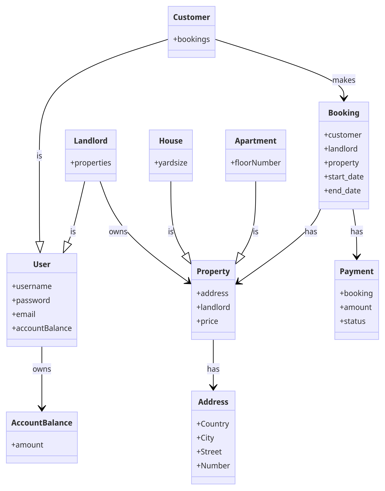

# Booking App :houses:
This app simplifies the process of finding and booking apartments and homes. Whether you're a customer searching for a place to stay or a landlord looking to list your property, this app comes in hand.

### :bookmark: Application main menu:
1. User registration (create user/account balance)
2. Account management (update user/account balance)
3. View users
4. Delete user
5. Read user
6. Create property (automatically create address)
7. Update property
8. Delete property
9. Read property
10. View properties
11. Add booking
12. See my bookings
13. Delete booking
14. Update booking
15. Read booking

### :bookmark: Classes:
- User:
   - Customer
   - Landlord
- Property:
   - Apartment
   - House
- Account Balance
- Address
- Booking
- Payment
### :bookmark: CRUD on following classes:
1. Customer
2. Landlord
3. Apartment
4. House
5. Account Balance
6. Address
7. Booking
8. Payment

## Features

### :bookmark: For Customers:

1. **View Bookings:** View the list of bookings made.
2. **View Properties:** View the list of available properties (apartments/houses).
3. **Booking Process:**
    - Select a property.
    - Make a payment (create Payment) – enter the amount, validate payment.
    - Register Booking if payment successful.
4. **Account Management:**
    - Deposit money into the account (Account Balance) / withdraw money.
    - Delete Booking.
5. **Update Booking**

### :bookmark: For Landlords:

1. **List Properties:** View the list of properties.
2. **Update Property:** Edit property details such as price, address, etc.
3. **Add/Delete Property:** Add or delete properties from the list.
4. **Account Management:**
    - Deposit/withdraw money from Account Balance. :heavy_dollar_sign:
    - Account Balance will be updated, once a booking was made on landlord's property :heavy_dollar_sign:
    - Update user details      

### :bookmark: UML diagram:

